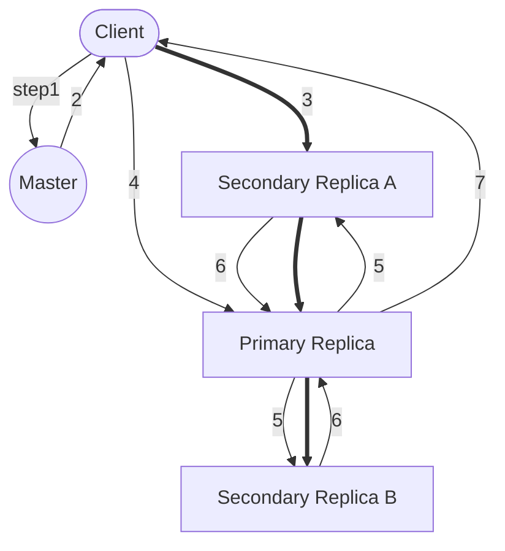
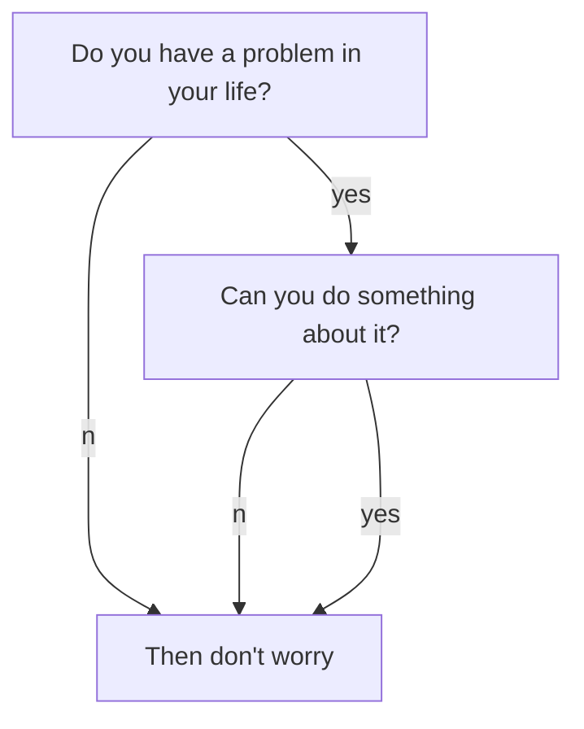

<!--more-->

## Observations
1. component failures are the norm rather than the exception
2. files are huge (billions of KB-size files, and multi-GB files)
3. mostly appending rather than overwriting
   * no random writes
   * often read only, and read sequentially
   * atomic append

## Design Overview
### Architecture
- a single `master`, multiple `chunkserver`, and is accessed by multiple `clients`
- easy to run both a chunkserver and a client on the same machine
- Files are divided into **fixed-size** chunks
  - identified by an immutable and globally unique 64 bit `chunk handle`, assigned by the master at the time of chunk creation
  - each chunk is repeated on multiple chunkservers
  - file name and byte offset can be converted to chunk index using the fixed size
  - lazy space allocation
  - 64 MB by default, **large** chunk size
    - reduce client/master interaction
    - persistent TCP connection to chunkserver over an extended period of time
    - reduces the size of the metadata
    - cons: some chunk can be hotspot
- master maintains all metadata
  - namespace
  - access control
  - mapping from files to chunks
  - current locations of chunks
  - chunk lease management
  - GC of orphaned chunks
  - chunk migration between chunkservers
  - communicate with chunkservers in `HeartBeat`, give it instructions and collect its state
- clients interact with the master for metadata operation
  - but all data-bearing communication goes directly to the chunkservers
- no cache of data
  - client can cache chunkserver metadata so it can have continous communication without the master

### Metadata

#### Types of metadata
- file and chunk namespaces (in memory + `operation log`)
- mapping from files to chunks (in memory + `operation log`)
- location of each chunk's replicas (in memory only)
  - ask each chunkserver at master startup and new chunkserver join

#### Operation Log
- historical record of critical metadata changes
- replicated on multiple machines
  - respond to a client operation only after flushing the log record to disk both locally and remotely
- use checkpoint to speed up recovery
  - compact B-tree like form 
    - directly mapped into memory
    - used for namespace lookup without extra parsing
  - a new checkpoint can be created without delaying incoming mutations
  - written to disk both locally and remotely
  - incomplete checkpoints are skipped during recovery

### Consistency Model

- file namespace mutations (e.g. file creation) are atomic
  - by master 
    - namespace locking
    - operation log defines a global total order

consistent
: all clients will see the same data, regardless of which replicas they read from

defined (after a file mutation)
: consistent, and clients will see what the mutation writes

- a mutation succeeds without interference from concurrent writes, the affected region is defined
- concurrent successful mutations leave the region undefined but consistent: all clients see the same data, but it may not reflect what any one mutation has written

## System Interactions
### Leases and Mutation Order
- leases to maintain a consistent mutation order across replicas. 
  - master grants a chunk lease to one of the replicas `primary`
  - primary picks a serial order for all mutations to the chunk

- client pushes the data to all the replicas
  - once all the replicas have acknowledged receiving the data, the client sends a write request to the primary
   
- the primary assigns consecutive serial numbers to all the mutations it receives (possibly from multiple clients)
  - the primary forwards the write request to all secondary replicas
  - the secondaries all reply to the primary indicating that they have completed the operation
  - the primary replies to the client

- any error at **any replica** is considered failure and trigger a retry

## Q&A
- why we need a region `defined`? 
  A: ???

- How the **at least once** works for the GFS append?
  A: Each record prepared by the writer contains extra information like the checksums. 
  A reader can identify and discard extra padding and record fragments using the checksums. If it cannot tolerate the occasional duplicates (e.g. if they would trigger non-idempotent operations), it can filter them out using unique identifiers in the record, which are often needed anyway to name corresponding application entities such as web documents. 
  Dedeplicate code is within GFS client. With that, the same sequence of records, plus rare duplicates, is always delivered to the record reader. 
